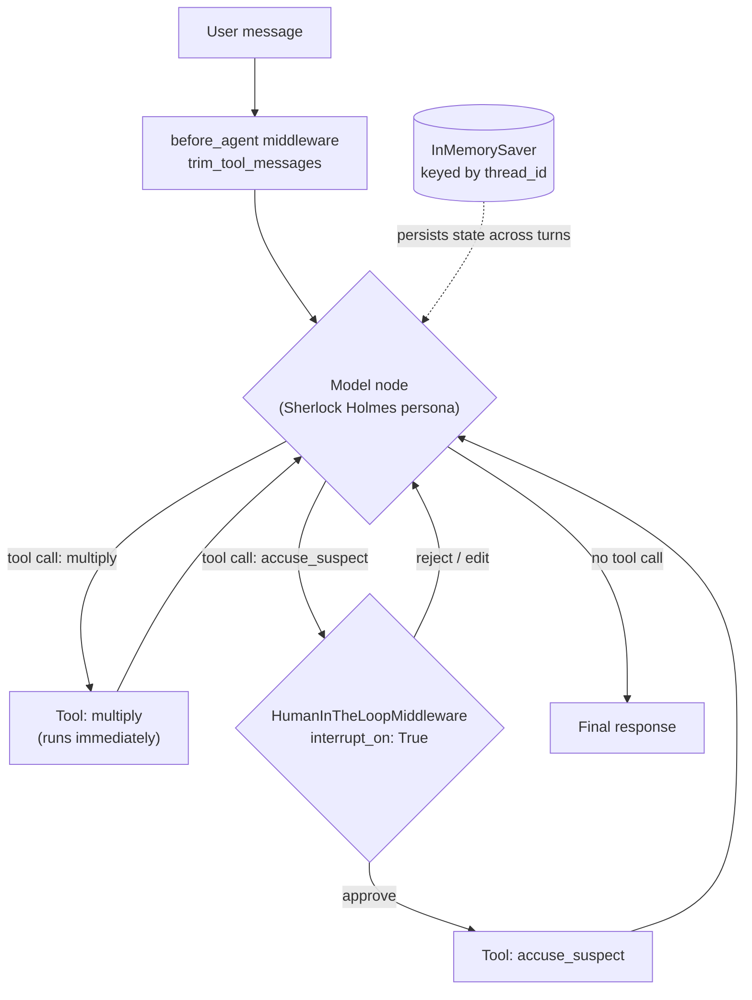

# Sherlock Holmes LangGraph Agent

A small, self-contained [LangGraph](https://github.com/langchain-ai/langgraph) ReAct agent (via LangChain's `create_agent`), built to demonstrate three concepts beyond a bare tool-calling loop:

- **Checkpointer persistence** — conversation state survives across turns on the same `thread_id`, and is fully isolated between different threads.
- **`before_agent` middleware** — a hook that runs once per turn, before the model is called, to trim stale tool output from history.
- **Human-in-the-loop** — one tool (`accuse_suspect`) is gated behind approval; another (`multiply`) is not, showing per-tool interrupt control.

The agent plays Sherlock Holmes: it answers in character, uses a `multiply` tool for arithmetic, and must have a human approve before it can formally `accuse_suspect`.

## Architecture



| Feature | Where | What it proves |
|---|---|---|
| Checkpointer | `InMemorySaver()` passed to `create_agent(checkpointer=...)`, invoked with `config={"configurable": {"thread_id": ...}}` | State (message history) persists across multiple `.invoke()` calls on the same thread, and is isolated between threads. |
| `before_agent` middleware | `@before_agent def trim_tool_messages(state, runtime)` | Runs once per turn before the model is called; here it drops stale `ToolMessage`s via `RemoveMessage` so tool output doesn't pile up in history. |
| Human-in-the-loop | `HumanInTheLoopMiddleware(interrupt_on={"multiply": False, "accuse_suspect": True})` | `multiply` executes immediately; `accuse_suspect` pauses the graph (`response["__interrupt__"]`) until a human resumes it with `Command(resume={"decisions": [{"type": "approve"}]})`. |

## Project layout

- `agent.py` — tools, middleware, and the `build_agent()` factory that assembles the `create_agent(...)` call. `build_agent(model=...)` accepts an injectable model so it can be tested without a live LLM.
- `main.py` — a runnable demo: the persistence walkthrough, then the human-in-the-loop walkthrough.
- `tests/test_agent.py` — pytest suite using `FakeMessagesListChatModel` (a scripted stand-in model), so tests run with no network access and no API key.
- `.github/workflows/tests.yml` — runs the test suite on every push/PR via `uv`.

## Running it

Requires [uv](https://docs.astral.sh/uv/).

```bash
uv sync
```

Add a Groq API key to `.env`:

```
GROQ_API_KEY=your-key-here
```

Run the demo:

```bash
uv run python main.py
```

Run the tests (no API key needed — the model is stubbed):

```bash
uv run pytest -v
```
